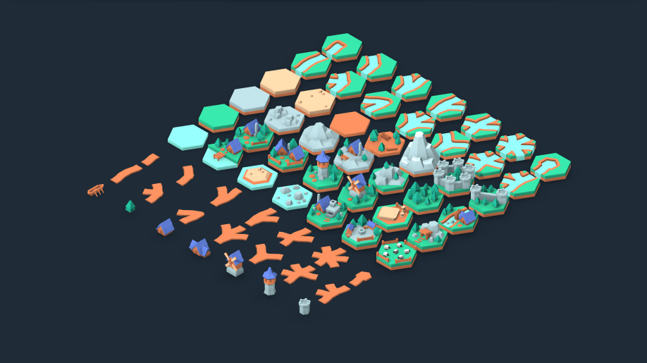

As I mentioned in [some previous update]()
I have been avoiding roads, although I have some theories on how to
make these work.

The first part of this however is just making roads appear in the
game world. The generation of roads is a bit pointless if I can't
see them. Also, I expect I'll need to do extensive debugging on road generation
and so I'll also need to see them.

The tileset I'm using[^1] has roads as separate models to be added to
the base tiles. The models cover all possible exit positions and
combinations, although they have been normalised so some combinations
and positions require rotating the model.

You can see the road tiles towards the bottom left corner of the 
image above (taken from Kenney.nl's website).

For all of the tiles I'm using, I load these into the game based on
some metadata about the tile, using a simple JSON file containing a
list of the tiles and their metadata. For example, on the main tile
set I have a metadata index containing:


{
    "water": {
        "prefab_file": "Tiles/water.glb",
        "tags": [ "water" ]
    },
    "grass": {
        "prefab_file": "Tiles/grass.glb",
        "tags": [ "grass" ]
    }
}


(Aside: we actually read the metadata first and call `load()` on the
`prefab_file` specified here, which gives us scenes to instance into
the world. Everything is loaded into a `Dictionary` for easy access.)

The same approach is taken with road tiles, where we annotate what
exits a given road piece has:


[
    {
        "exits": [ "right", "left" ],
        "prefab_file": "Roads/path_straight.glb"
    },
    {
        "exits": [ "right" ],
        "prefab_file": "Roads/path_start.glb"
    }
]


As mentioned above, each road piece needs to be rotated to produce 
all of the possible combinations. The `path_straight.glb` piece has
two other rotations available, 60 degrees should give us exits of
`[ "up_right", "down_left" ]`, and 120 should give us `[ "down_right", "up_left" ]`. (Probably, I haven't checked this is correct!)

In the first pass of this code, I just wrote out the combinations by
hand, adding a `"rotation"` field to the metadata. But I quickly found
this was cumbersome, more so when I got the exits for a given rotation
wrong (usually 0 degrees, so everything from there was wrong!). 
Instead, we produce all of the other possible exit positions for a 
road piece by iterating over the six different possible rotations and
rotating the exits at the same time.

At this point, it's useful to talk about how I resolve a tile having
a specific list of exits to a road piece. We need to ignore the order
the exits were provided in, and we need a fast way to look it up.

The naive implementation would be to stick all the exit combinations
into an array that points to the tile/rotation needed. Then we walk over
every element in the array of combinations, and then on each combination
(itself an array) we compare it to the array of exits we have.

This is slow, we're walking all possible combinations, and then also
doing a bunch of array walks and then string compares to compare the
exit arrays. Now, maybe this is premature, but there are faster 
ways to do this.

Instead of storing the possible exits as an array of strings, we 
convert them to a bitfield. This has a few advantages:

* It reduces the exits to a fixed order, regardless of how they 
  appear in the metadata
* Bitfields are trivial to compare, they end up just as an `int`
* Using an `int` as a `Dictionary` key is fast and reliable
* Rotating the exits is very easy in a bitfield

Now some of my younger readers will be wondering why on earth I would
go deep into integer math to do this. Well, my programming roots 
include a great deal of C (that's C, not C++, not C#) on microcontrollers,
and that space is all about bitfields. And one thing you learn quickly
in that space is when you have very few cycles, bitfields are very
efficient at solving a bunch of problems.

During import of the road pieces, we convert the exits array for a
piece into a bitfield. We do this by assigning a bit to each exit,
and the order of the bits corospond to going around the possible
rotations. In sort of psuedocode, we do this:


str_to_mask = { 
    "right": 0x1, "up_right": 0x2, "up_left": 0x4,
    "left": 0x8, "down_left": 0x10, "down_right": 0x20
}

function exits_to_mask(exit_array) -> int
    mask = 0
    for exit in exit_array:
        mask = mask | dirs_to_mask[exit]
    return mask


The magic numbers are just the hexadecimal value of each bit being set
(and only that bit).

When stashing the road tile, we then use the mask for the key in the
`Dictionary`, which will be a trivial lookup. (Aside: nearly O(1) if you
really want to know.)

I said above that rotation is easy as well. If we've got an array of
strings, we can't just move the array contents around, we have to map
each exit to the exit rotated one step around. The map is not slow 
itself (we can just have another lookup table), but in addition to all
the string comparisons in the lookup table we need to walk all the
exit array members. 

Instead, with the bitfield approach, we can rely on bit-shift
operations to do the rotation, with a small bit of work to manage
roll-over. Bit-shifting is often implemented in pure hardware, so
it is reasonably efficient. Rotating the exit list each item is then just:


function rotate_exits(mask) -> int
    # shift all the exits along
    mask = mask << 1
    # pass the rollover bit to the bottom
    mask = mask | (mask & 0x40 >> 5)
    # only keep the bits we're interested in
    mask = mask & 0x3f
    # and return it
    return mask


(Aside: most calculator apps will have a programmer mode that includes
bit-shift and logical operations, which will show why this works.)

Given this, it's fast to generate all the other road exit combinations
for a given road piece, and to look up what piece we need for any
combination.

For storage of road information, we mark tiles as having a road, and
store the bitfield of exits. Adding a new road exit is purely 
doing a bit-wise OR on that exit in the tile. We also need to adjust
the neighbour tile to reflect the connection back, but this is also
a bit-wise OR. 

This reduces our display effort to something very easy, just pull the
road bitfield, look up that value in the index of all road pieces 
that are index by bitfield, and spawn the object in the correct place
and rotation.

Easy!

[^1]: [Kenney.nl Hexagon Kit](https://kenney.nl/assets/hexagon-kit)
