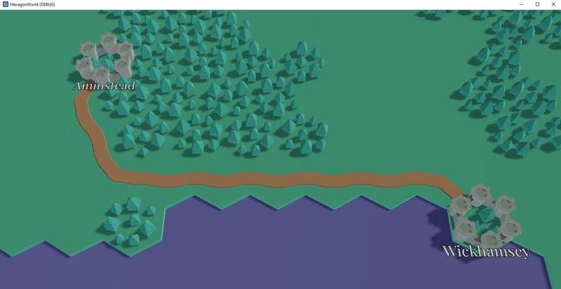

Well, it wouldn't be my code development if any design pattern lasted
longer than four hours! In fact, in the [previous post]()
it omits the details this was actually the second pass, where we 
stored masks in the tile data directly, rather than in a different
set of dictionaries. 

But, before tackling changing everything again, I did get to a better
place about how to draw roads on the map. Not the display part now,
the actual "draw road from A to B" including all the steps needed
to join them.

Pathfinding is a well trodden area in game design. There's a bunch of
methods, but the [A* algorithm](https://en.wikipedia.org/wiki/A*_search_algorithm) fits my needs pretty well. This involves
building a graph of nodes connected by edges, and assigning weights or
costs or whatever you want to call it to traversing the node or edge.

I was thinking I might have to build A* myself in GDscript but what's 
this? Oh, Godot already includes A* classes to do all the work for me.
Well, most of the work anyway, the traversal bit anyway. In Godot 4
we actually get three different versions of A*, mostly separated by
the node elements.

Because we're doing pathfinding on a 2D plane[^1] we'll use the `AStar2D` 
class for our pathfinding. This provides two virtual methods we will
need to replace, `_compute_cost()` and `_estimate_cost()` which given
two points returns the exact or lower-bound cost of the path between
the two points.

We have to overide those as we want our costs based on axial coordinate
distances, not cartesian coordinates for the tiles themselves. And
the `AStar2D` wants nodes with cartesian coordinates (specifically, it
expects `Vector2` coordinates). I should point out, this is noted in
the Red Blog Games Hexagon Guide about [Pathfinding](https://www.redblobgames.com/grids/hexagons/#pathfinding),
and is not something I've pulled out of skill or knowledge myself!

As we have a grid of tiles (albeit a hexagon grid), we'll just throw
a graph containing a node for every tile, and connections from each
node to all neighbours that meet appropriate criteria (mostly, can put
a road on it!)

At this point, the current implementation and the one I want to move
to changes a bit. I've added costs to the metadata about tile types,
as we're applying something simple as a policy: tiles like grass
are easy to move on, tiles like forests and mountains are harder but
not impossible, and water should be impossible .. for now.

I am making forests and mountains hard but not impossible to produce
roads that tend to avoid these obstacles rather than plow through them,
but will plow through them when there's little choice but to make a 
very large detour around them. I think this will produce a pleasing
balance between direct straight line roads and roads which have nice
natural curves and meandering.

As it happens, building the graph the `AStar2D` class needs is 
remarkably easy. When we create a new tile (using the badly named
`set_tile()`) we generate the point index the graph wants and store
it with the tile. Then in `update_tile()` (which gets called either
directly or by `set_tile()`) we add/update the point in the graph
with the cost of that type of tile. This means when we change tiles
we also update the costs in the graph of the tile.

However, we also need to maintain the graph, so we do this in `update_tile()`
as well. We also need to remove the point if the tile is no longer 
navigable, and connect or disconnect points in the graph as well. For
connecting and disconnecting points, we walk our neighbours and check
if they are appropriate to move into, and then add these appropriate
connections.

In psuedo-code, for each tile we update it looks like:


if updating tile:
    if tile_type is allowed road:
        add/update this point in graph
        for each neighbour:
            if neighbour is allowed road:
                add connection between this tile and neighbour tile
            else:
                remove connection between this tile and neighbour tile
    else:
        for each neighbour:
            remove connection between this tile and neighbour tile
        remove point from graph


Once we have the graph with nodes, we can ask it for the path between
two points. Because the `AStar2D` class expects point indexes, there's
a bunch of translation back and forth between axial coordinates of
tiles and the point index. But, that's fairly quick and thus we have
roads which look more natural:

I said there were things I wanted to change, and in writing this down
plus the development issues, I think it will be reworked a bit very
shortly. 

The first problem is that as road pieces are expected to sit on a
tile, they clash with some tiles. Forests, for example, don't really
look so good with a road going through them because the trees on the
tile look like they're on the road. To work around that, the
current version just forces the tile to grass if it was forest before.

The other problem is water. Water is currently not allowed for 
traversal. It makes no sense, it's a road, not a boat. How this
is going to be managed is uncertain, but it'll have to be some
how. The map may end up with a slice of water dividing it in two
and without any way of generating a road between the two sides. 

But these are problems for another day.

[^1]: The world is a flat plane even if we were to jazz it up a bit
with tiles at different heights. That is, the player can't decide
to go up or down within a tile, they can only go to whatever height
the tile is. So all our positions are 2D, thus navigation is on a
2D plane.