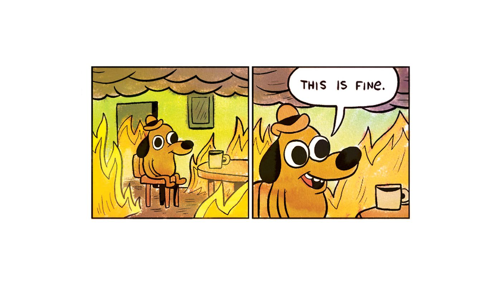

So I am now deep in the refactor well, and I'm pretty sure I can 
eventually get myself out, but right now everything is broken
until I get to the bottom of the well, and start digging my way
up.

What triggered this was supporting roads. In the picture I posted
on [the last update]() there
was a lovely road going through the gap in the forest. But there
wasn't a gap there really.

The road pieces can be spawned on top of any tile, and that's how
it looks like it could be used, but then you can't really use them
on any tile which has other things on it. That is, it works on 
the plain flat tiles, but not say a forest tile. On a forest tile,
you get a look of a road which has trees all over it.

To work around that did a quick hack to just force the tile to one
of the plain flat ones when a road gets created on a tile that isn't
so well designed for roads. Thus, the picture of the road going
through the gap in forest is really the road mowing down all the
forest tiles in its way on the shortest bit of forest to cross.

I didn't really like that, a road piece that neatly weaved through
a forest closely would be nicer. And nicer becomes "let's refactor
the entire world".

The upside is the tiles will look better when done, and at the same
time I have half an idea of how to manage water traversal as well. 
It'll involve less objects in the world as well.

I have progressively integrated the road pieces, in some cases 
recolouring them, into the base tiles and adjusted the decorations
on those tiles to allow the road piece to fit in, and then collected
it all into a new tile - original base tile plus road piece - so 
they can be spawned at once. 

This is mostly some work in Blender, since the tiles are all easily
messed with in Blender. Using Blender falls into that slightly annoying
tool space where [KiCAD](https://www.kicad.org/) lives in my head as well.
It's one of those tools where knowing the keyboard actions *really* matters
and without that you will struggle to do anything quickly at all.

Anyway, that bit is done, I have many more tiles than I had before,
and the ugly code and metadata reorganisation has begun.

I'll surface in a few days to report why I shouldn't have done this.