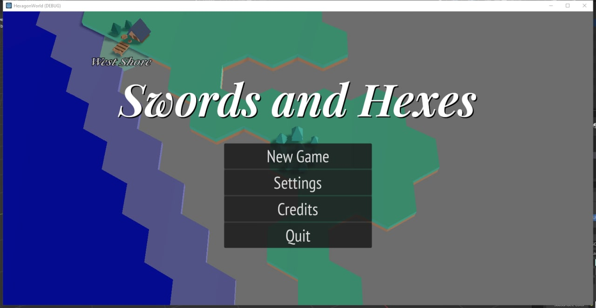

Around a month ago, I started writing this silly game and I must
admit I am still surprised it's gotten to the point it has. I expected
that world generation would really be my undoing, and instead it 
seems to be going okay.

## Then vs Now

## Current State

So where are we at now? Well, here's a short list of what was done
in the last month:

* Interim camera movement (currently using WASD)
* Hexagon tile placement, along with most of the math to manage
  simple tile relationships (like neighbours)
* Tile attributes are not hard-coded, but defined in JSON and 
  interpreted by the code building the current view
* Tiles are spawned/removed automatically by camera view
* Tiles can have a decoration placed on top, and rules enforced by
  attributes in JSON
* Tile decorations can react to roads and push to a different decoration
* Tile models can be normalised for connections to other tiles, generate
  the rotation of tiles needed to make all possible combinations
* World Generation:
  + Repeatable generation from a seed
  + Biomes (defined but not yet used)
  + Terrain (including height)
  + Forests
  + Cities with walls, generated names, and internal details
  + Transport built between cities that respect terrain (roads for land,
    boat paths for water, and transition details between land/water),
    terrain has costs for being traversed depending on tile and height,
    avoidance of tiles or tile decorations for transport paths
* Saving and loading game state including map
* Managing save game slots
* Global setting saving and loading (eg, music volume)

Yeah I really am surprised all that got done, and works.

## Unrealistic Future Plans

The next month or so I want to focus on two things:

* Finish world generation
  + Build "counties" for difficulty level
  + Add more POIs than just cities (like, villages, mines, farms, 
    lumber yards, mills, and watch towers)
  + Add a little more detailing to grass than just bulk forest
* Movement
  + Visual representation of where the player is
  + Show navigation rule application
  + Allow player to move around the map
  + "Fog of War"-like discovery of the map

Let's see how this all goes!