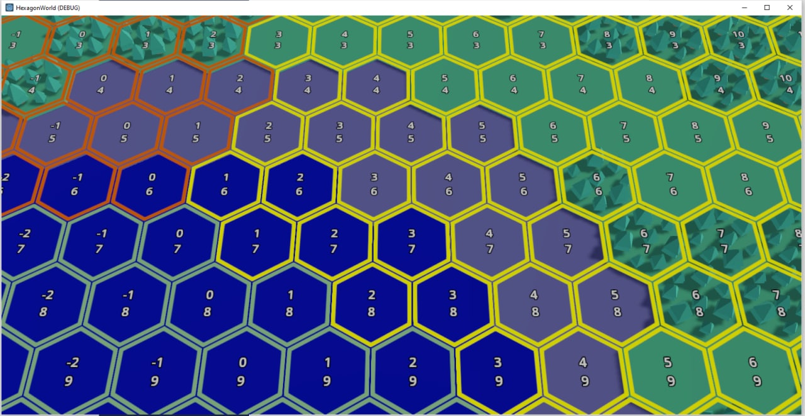
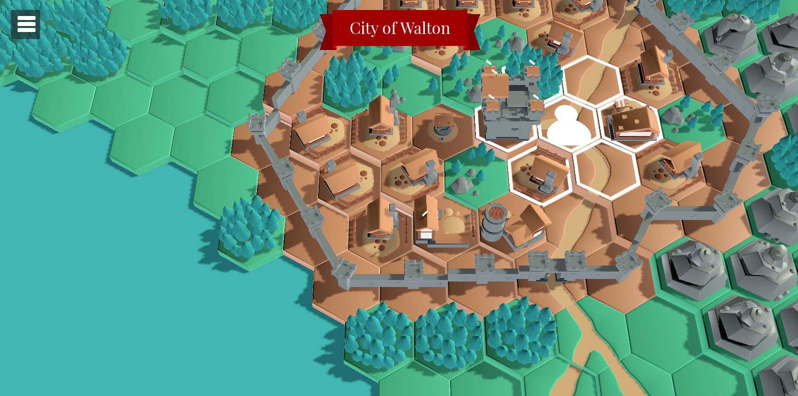

After much deliberation, I ended up doing none of the things I thought
as options when I wrote the [last post]()
.. and as it happens this ended up being a fairly simple implementation.

Stashed in the back of my code was a prefab I used for a lot of the early
testing of biomes. Back then it looked like this:



The prefab itself is just a holder for a `Sprite3D` which was sized correctly
to show as a border. It's really just a PNG file with transparency. Anyway,
I'd used it a fair bit, and even called it the "selector" prefab in the code.
It had a script attached to do simple things like change the colour of the
selector (by using the `modulate` property on the `Sprite3D`).

But I hadn't actually used it for selection .. until now. Now it was 
definitely the shortest path to just showing what we could select as 
movement tiles. It was an already defined and built prefab, and because
it was intended to be spawned only on tiles you could select, it made
sense to just bake a collider into it as well.

Now I had something I could spawn into the world which had both the visual
indication to the player and the collider needed to make that space pickable.
After that, it was a quick trip through the neighbours of the cell the player
was on, and we're off to the races.

When we're walking the neighbours for the current position, we need to test
if we can move there. I had originally thought about baking a whole 
navigation mesh (probably actually just a filtered version of the one used
to build roads?) but actually we can test the neighbours pretty fast against
some simple policies.

So now every tile has player access policies called `player_allowed`:

```json
{
    "type": "grass",
    "prefab_file": "Tiles/hex_forest/hex_forest_detail.gltf.glb",
    "cost": 1.0,
    "road_cost": 0.2,
    "allow_rotation": true,
    "player_allowed": "always"
}
```

The same was added to decorations:

```json
[
    {
        "type": "dock",
        "prefab_file": "TileDecorations/dock.glb",
        "tile_types": [ "water" ],
        "allow_rotation": true,
        "allow_roads": true,
        "show_roads": true,
        "player_allowed": "road_only"
    }
]
```

There are three policies: `never` which blocks player movement either by 
decoration or by base tile, `road_only` which requires a road defined on the
base tile (either enforced by decoration, or by the tile itself), and `always`
which is treated as a fall-through for decorations and a hard policy for 
tiles.

(Aside: Yes, `always` on a decoration really means `well_maybe` but anyway..)

After walking the neighbours and testing if we can use them, it's straight
into spawning some prefabs and managing them coming in and out of existance
as we move.

The work handling clicks had already been done in testing out if I needed
to modify all tile prefabs.

So we have player movement! It respects tile polices, so players can cross
water if a boat path (internally just a road with a pretty tile) but not
walk out on to any water. Mountains block you walking through them. 

I made a quick video (with no audio because it's mostly disabled in game
at the moment), which appears below:



The player icon is definitely very placeholder. I'm not sure what I want
to do for that.

The last part, and made after the video was uploaded, was to finally 
clean up the placenames display. For a long time I've used an on-map
`Label3D` which provided world-space text, and sort of tried to make it
flat on the map just below the castle.

Well cities are a lot more than just a single castle tile now, and the
flat label looks quite bad against the selection hexes, so it was time
to move them out of the world map and into the UI. 

There's now a banner at the top of the screen which shows the current
placename (just cities for now). It fades in/out as you move in or out
of a city. It's much cleaner I think than the old map label.



I think they're a huge improvement, but will also allow me to name 
general areas, such as lake/ocean pieces, counties, or biomes. The UI stuff
is very very slowly starting to feel like it does what I want it to do
with only *some* tearing of hair out. Previously I would lose a lot of 
hair and have no UI to show for it!

Of the goals for the next month, all but one of the movement ones are now
done which is nice for only a couple of days later! Don't expect that
much progress in the rest of the month however!