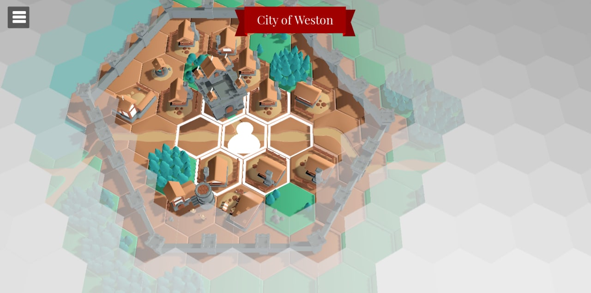
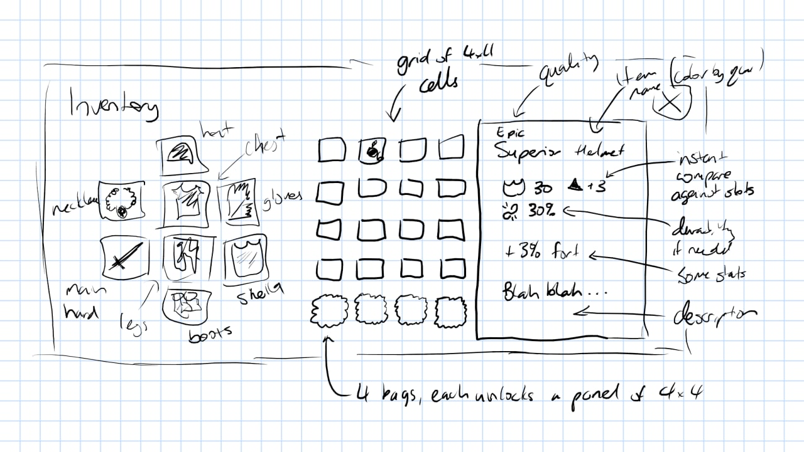
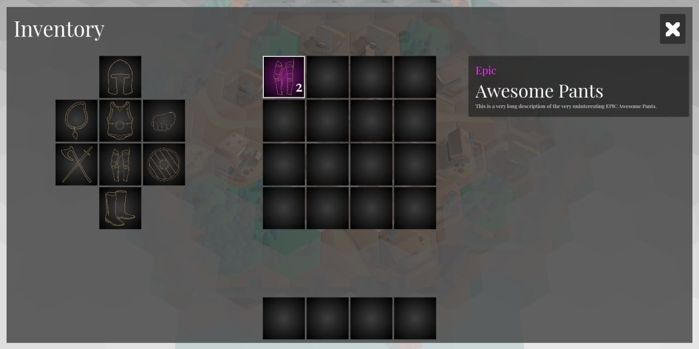

## World View and Gen

The world view needed one more piece of polish before I really need to 
get on with some of the other systems in the game. While I do want
to enrich the world generation with villages and more POI, that's something
which can easily come later.

In the monthly update, I mentioned that the world needs some sort of fog
system for unexplored tiles. I played around with a few different methods,
but in the end it actually was easiest to just use `Sprite3D` set at an
appropriate height, with some noise-based colouring and alpha for edges.
To avoid needing to deal with different terrain heights, the `Sprite3D` 
was marked as skipping depth test, so simply overdraws without taking into
account the actual Z value for the cloud object.

The result is fairly reasonable in the end:

Putting aside the basic world view I think is really needed or I will 
forever be fiddling with the way it looks and is generated, and never
get on with other parts of the game.

## Inventory

The first step to any combat, quest, or other system is going to be items.
We need to have items in the game for combat reasons, as part of quests,
and likely a bunch of other things. For the first time while developing
this game, I did a quick hand drawn mock up of what the Inventory screen
should look like:

This concept has the panel divided into three broad areas. The left is
the equipped, the middle the main inventory, and the right has a panel
for the item selected. It's slightly different to how an inventory might
work on a PC game, specifically around how to do item comparisons.

Most of the time if you get a new item, you want to know if it's better or
worse than an existing item. This is so common a need that games which 
don't have it and allow modding almost certainly have a mod which allows
instant comparisons on hover.

We can't really do things like comparison on hover, so instead the panel
on the right is both displaying the details about an item and includes
some instant comparisons against the currently equipped item. That way,
you can just tap the item in the inventory to get both details *and* if
this item is better than the current one you have on.

For the middle panel, I've gone with a fixed 4x4 grid for 16 slots. Rather
then implement any complex logic like weight or volume or items spanning
multiple cells, I've gone with a plain dumb one item one slot deal. No
weight limits or stuff, you can carry a bus if we had a bus item. This is
intended to be a casual game, inventory management as a whole mini-game is
something that I personally find annoying anyway.

Below the main grid is some slots for bags. I'm still uncertain if I'll
implement this, or just make the main grid bigger. THe intent anyway is
each bag slot when populated with a bag unlocks another 4x4 panel. It's
dumb but it'll work fine.

Equipping will be done by dragging items out of the inventory to the 
equip space. This will actually free up the slot in the inventory space
(we're not going to make you have equipped items also in your inventory).

Anyway, that's the plan. The first early attempts at building this have
gone okay so far:

The background of any inventory slot will be coloured by item quality,
as I prefer having an easy visual guide for junk vs awesome, more so once
we implement shops and looting. It has a space for the stack amount for
stackable items, and placeholders for a bunch of other things.

## Item Data

At the same time, I've started out the item data itself. I'm still fleshing
out some details. I like items having a quality, but I'm unsure if I want
a level as well (which influences range of stats I guess?).

I think stats and effects will just be a single array of Things This Has
and we process it for stats and effects when drawing the item detail
panel. 

But at the moment, the item data is pretty basic. It shall be filled out 
soon enough.