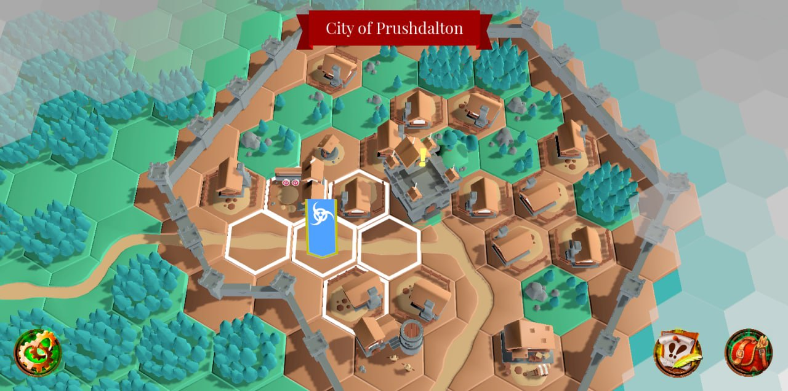

Things have been a bit slow in the last few days. But, still making
some progress even if I've been distracted into rabbit holes.

## Inventory

After reworking all the inventory code to separate equip slots on the
player from what an item knows about where it can be equipped, the
last part was correctly wiring up the actual inventory storage on
the player.

One problem not mentioned in previous posts is Godot 4 still has some
bugs in places, which is not unexpected given it's still only Beta.
The inventory save/load was getting hung up on a serialisation bug
in `store_var()` and `get_var()`, which write and read any variable
type to and from files.

The deserialisation is choking on some aspect of the type of variable
I was passing, specifically a class object that mostly just stores 
things and has a few functions attached. This meant I had to manually
serialise and deserialise the class in the save/load code. 

It's done now, it's ugly, but it gets us moving forward.

I also cleaned up the handling of `TWOHAND` items so it correctly
locks the off-hand slot when this type of item is equipped. 

The inventory is largely done. The only things missing are a summary
of equipped effects (at least passive effects) and enumerating all
the icons for inventory items. I have a large collection of icons
from a paid source and I need to index them and do things like
assign them some attributes like weight or style.

## Quests

While Inventory isn't completely done, I started to work out what
quests is going to look like. The first problem is actually we need
a way of showing in-game there is a quest on a particular tile.

This would be the classic yellow exclamation mark or question mark.
The universal symbol for "quest". I wanted to make these stand out
on the world so they need a glow and they need to move.

I built a "quest indicator" prefab consisting of both types of 
indicator with a way to ask for the one desired, and added an
animation player and track for making them spin. For simplicity,
we just spin both of the indicators even if only one is visible.

The tile decoration data was also modified to include an offset
for the quest indicator, so it would be placed just above any
decoration on the tile. This has be done per-decoration so they
look associated with the decoration.

The indicator itself I was going to make a 3D model for, but as
it happens there's support for 3D extruded text in Godot, so the
indicator models are just that.

The question mark looked wrong when spinning, due to the pivot point 
being offset from the dot at the bottom. It looked better to have the
dot spin in-place and the rest of the symbol around it. This involved
just layering a bunch of `Node3D` to apply an offset and then spinning
the parent of the layers.

Lastly, the markers needed something more to make them stand out, so
I looked at how to make them glow. This is not obvious how to do 
within the default shaders in Godot. The method involves changing the
`World Environment` resource to have glow enabled, and tweaking the
`hdr_threshold` for when to have the object glow. Then any object
with a material that has any albedo above the threshold will glow..
which counter-intuitively to me was where R, G, or B was higher than
1.0. Hence, "HDR" mentioned before.

Anyway, that kinda worked. It looks washed out but glowing and that's
good enough. 

This leads into..

## Showing the player

I've struggled with how to show the player in the world. At times I
thought it would be best to have an actual player model (maybe based
on something the player chose) but the design of the tiles doesn't
always suit that.

For now I've settled on having a player-determined banner representing
their position in the world. This is just a bunch of `Sprite3D` layers
with different PNGs build in Inkscape, but it'll do for now.

The banner is set to overdraw always, which makes it look a little odd
when you move behind very tall objects. But if it wasn't set to overdraw
everything, it looks even worse when place on top of very tall objects.

It's just a compromise I'll have to accept.

## Next goals

Next up will be a few more things around quests and the player:

- Build the new game menus to include player names, world seed,
  and banner building.
- Build a quest UI for the current set of taken quests.
- On-screen quest tracker
- Implement a proper data model for quests that exist and are placed
  in the world

I'm also likely to start reskinning some of the UI elements to be 
more game-like. They are still too much default out of the box
elements.
